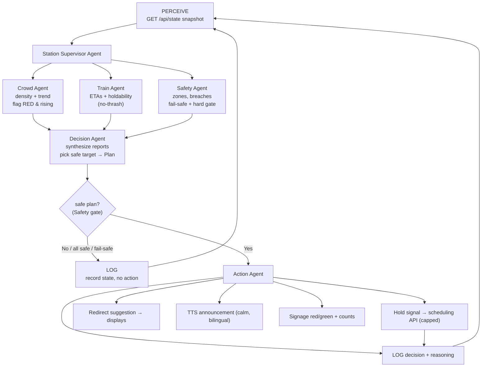
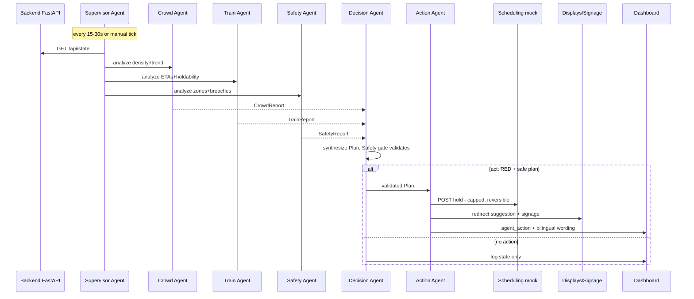
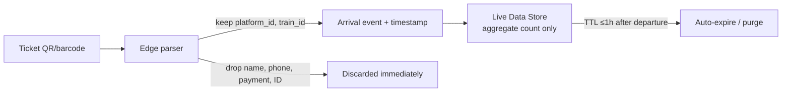

# Application Flow
### Autonomous Platform Crowd-Balancing Agent
**Hackathon:** FAR AWAY 2026 (Zuup Japan) — Theme: Railways
**Status:** Draft v1.0 · **Last updated:** 2026-06-14

---

## 1. High-Level Flow


*PNG/SVG sources in [`docs/diagrams/`](../docs/diagrams/) · re-render with `render.sh`*

```
Passenger ──scan──▶ Gate ──event──▶ Backend ──┐
                                              ├──▶ Live State ──▶ Agent Loop ──▶ Actions ──▶ Passengers + Operator
Camera ──frames──▶ YOLOv8 ──density──▶ Backend ┘                                  (hold / redirect / announce / signage)
```

The system runs two continuous input streams (ticket arrivals + CV density) into a
fused live state, which the agent polls on every tick and acts upon.

### System Architecture (component view)


---

## 2. Passenger Journey (Happy Path)

1. Passenger arrives and **scans ticket** at the gate.
2. Scanner reads **platform number + train ID only** — no name/phone/payment.
3. Backend logs **"+1 person → Platform A"** with timestamp (only record kept; auto-expires after departure).
4. Cameras continuously estimate **platform density %**.
5. The Agent watches **arrivals + density + schedule** across all platforms at once.
6. If Platform A > danger threshold while Platform B is under-utilized, the Agent
   autonomously: **(a)** holds Platform A's train a little longer, **(b)** *suggests*
   newly-arriving passengers consider Platform B, **(c)** makes a **calm announcement**
   explaining why.
7. **Display boards** turn red/green so passengers see, at a glance, which platform is
   busy and which has space.
8. **Control room** sees everything on a dashboard with live graphs — but does not need
   to act; they override only if something unusual happens.

---

## 3. Agent Decision Loop — Hierarchical Multi-Agent (every 15–30s)

A **Station Supervisor** fans out to three **parallel** perception agents, whose reports
a **Decision Agent** synthesizes into a safety-validated plan that an **Action Agent**
executes.



> The Safety Agent's gate is authoritative — the Decision/LLM layer can never produce a
> hold over the cap or a redirect into a crowded platform. On stale/missing data the
> Safety Agent raises **fail-safe → no action**.

---

## 4. Worked Example — Platform A Crowded, Platform B Free

**Setup**
- Train 12045 due at **Platform A in 6 min**; Platform A at **92% (RED)**.
- Train 12046 due at **Platform B in 9 min**; Platform B at **35% (GREEN)**.

**Agent reasoning (LLM + rules)**
> "Platform A is over threshold and rising. Platform B has spare capacity and a train
> arriving only 3 minutes later. Action: redistribute and buy time."

**Actions**
1. **Hold Signal** — send `hold +10 min` to Train 12045's scheduling system; Platform A
   clears as the current train absorbs the crowd.
2. **Redirect (suggestion)** — gate display for A-bound passengers: *"Platform A is busy.
   If your train allows, Platform B (2 min walk) has a train arriving sooner with more
   space."* Always a suggestion, never forced.
3. **Announcement (TTS)** — calm voice: *"Attention passengers waiting for Train 12045 —
   this train will be held for a few extra minutes for your safety and comfort.
   Passengers heading to Platform B, your train is arriving shortly with more space."*
4. **Signage** — Platform A board → **red** with live count; Platform B board → **green**,
   *"Train arriving in 4 min — extra capacity available."*

**Result**
Platform A density drops as the held train absorbs the existing crowd and new arrivals
are gently nudged to B. Platform B receives redirected + waiting passengers but its train
arrives sooner, so it does not overcrowd either. **No stampede, no panic, no alarming
announcements.**

---

## 5. Sequence Diagram — Decision → Action



---

## 6. Control Room Operator Flow

1. Operator opens dashboard → sees platform cards (color), density line graph, Agent
   Action Log.
2. Agent acts autonomously; each action streams to the log with plain-English reasoning.
3. On an anomaly, operator clicks **Override** on an action → `POST /api/override` →
   action reversed/cancelled; logged as operator intervention.
4. Operator does **not** need to act in normal operation — the system is autonomous by default.

---

## 7. Ticket Scan Flow (Privacy-Preserving)



---

## 8. Failure & Fallback Flows

| Condition | Behavior |
|-----------|----------|
| LLM/API unavailable | Rule engine still acts on hard thresholds; announcements use pre-scripted templates |
| Stale/missing density signal | Fail safe: agent takes **no action**, raises operator alert |
| No safe redirect target | Hold-only (if safe) + operator alert; never redirect into a crowded platform |
| CV jitter / miscount | Rolling average smoothing; zone thresholds tolerate noise |
| Operator override | Action cancelled immediately; logged |

---

## 9. Demo Run Script (Under 2 Minutes)

1. Open dashboard (two green platform cards).
2. Click "scan" repeatedly / feed clip → Platform A count climbs → card goes Yellow → Red.
3. Agent loop fires: action log shows reasoning; Platform A train held; B-bound
   suggestion appears; TTS plays; A board red, B board green.
4. Watch Platform A density curve bend down within the held window.
5. Point to the data store: only counts/percentages/timestamps — **no PII, no frames**.

*See [PRD.md], [TechSpecifications.md], [Design.md], [Schema.md], [ImplementationPlan.md], [Rules.md].*
