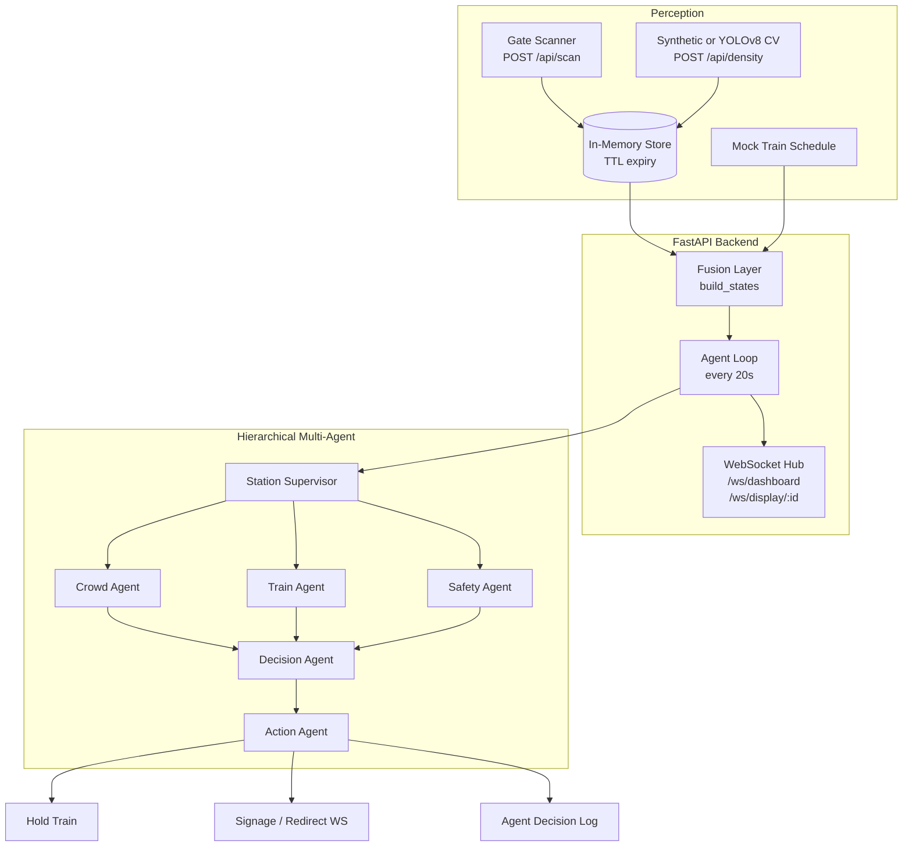

# Autonomous Platform Crowd-Balancing Agent
### 群衆バランス・エージェント · FAR AWAY 2026 — Theme: Railways

> *"No stampedes. No chaos. Just smart, autonomous, real-time crowd balancing —
> with zero personal data collected."*

An AI station-master that watches every platform at once, spots a dangerous crowd
**before** it forms, and acts on the **infrastructure** (trains, signals, signage,
announcements) — never on people — to keep platforms balanced, safe, and calm.

---

## The Problem

Railway stations regularly face dangerous platform overcrowding — passengers pile onto
one platform while an adjacent one sits half-empty, because no one has real-time
visibility into crowd distribution. This causes:

- **Stampede risk** during peak hours and festival rushes
- **Pickpocketing & lost luggage**, which thrive in dense, chaotic crowds
- **Frustration & altercations** from delays and confusion
- **Inefficient train holding** — trains depart on fixed schedules regardless of crowd

Current systems are either fully manual (staff watching CCTV) or purely informational
(a crowd count with no action). **Nobody closes the loop.**

---

## The Solution

A **fully autonomous agent** that perceives platform density in real time, reasons about
the best action, and **acts on its own** — holding trains, suggesting redirections,
updating signage, and making calm announcements — with **zero human intervention** and
**zero personal data collection**.

**In one line:**
> Scan your ticket → the Agent sees live density on every platform → if one is
> overcrowded and a nearby one isn't, it holds that platform's train a few extra minutes,
> *suggests* new arrivals consider the other platform, and announces the change calmly.

### Key Principles
- **Privacy-first** — only platform number, train ID, and timestamp are logged. No
  names, faces, or personal data; no raw camera frames stored. Data auto-expires after
  the train departs (DPDP Act 2023 / APPI compliant).
- **Fully agentic** — a continuous *perceive → evaluate → decide → act → log* loop; no
  operator needs to click "approve."
- **Safe by design** — a hard rule engine is always authoritative; the LLM only chooses
  among safe options and drafts wording. Fail-safe = take no action.
- **Suggest, never command** — the agent *informs and suggests*; it acts on
  infrastructure, never physically directs people.
- **Wa-modern, bilingual UI** — Japanese-railway-inspired design (JR / Tokyo Metro),
  日本語-first signage and announcements for real-world deployability in Japan.

---

## System Architecture

A **layered hierarchical multi-agent system** sits at the core: a Station Supervisor fans
out to three parallel agents (Crowd / Train / Safety), a Decision Agent synthesizes their
reports into a safety-validated plan, and an Action Agent executes it.



**Flow:** scan ticket → log anonymous arrival → cameras estimate density → Supervisor
perceives state → Crowd/Train/Safety analyze in parallel → Decision Agent builds a
safety-validated plan → Action Agent holds the train, suggests a redirect, announces
calmly, updates signage → every decision is logged with plain-English reasoning for human
oversight (not control). The **Safety Agent's gate is authoritative** — the LLM can never
produce an unsafe action.

**Zones:** Green `<60%` · Yellow `60–85%` · Red `>85%`

---

## Tech Stack

| Layer | Tools / Libraries | Purpose |
|---|---|---|
| Ticket Scan / Entry | QR/barcode scanner, FastAPI | Capture platform + train ID, log arrival |
| Crowd Detection | YOLOv8 (Ultralytics), OpenCV | Real-time per-platform person counting |
| Data & Trends | Pandas, NumPy | Rolling density %, trend detection |
| Visualization | Recharts, matplotlib | Live density graphs, zone heatmaps |
| Agent Core | LangGraph (hierarchical multi-agent) | Supervisor → Crowd∥Train∥Safety → Decision → Action |
| Reasoning | Claude (`claude-haiku-4-5` / `claude-opus-4-8`) | Decisions + calm announcement drafting |
| Voice | ElevenLabs / gTTS | Calm, bilingual station announcements |
| Backend | FastAPI + WebSockets | Real-time event handling, live push |
| Frontend | React + Tailwind CSS | Wa-modern control-room dashboard & signage |
| Frontend Hosting | Vercel | React build, static serving |
| Backend Hosting | Railway | FastAPI + WebSocket + agent loop |

---

## Quick Start

Run the backend (FastAPI + agent loop) and frontend; the multi-agent pipeline runs
**inside** the backend and auto-ticks every 20s — there's no separate agent process.

**Backend** — http://localhost:8000
```bash
cd backend
python -m venv .venv && source .venv/bin/activate
pip install -r requirements.txt
python -m uvicorn app.main:app --host 0.0.0.0 --port 8000
```
Health check: `curl http://localhost:8000/health`

**Frontend** — http://localhost:5173
```bash
cd frontend
npm install
npm run dev
```
Vite proxies `/api` and `/ws` to `localhost:8000`, so just run both.

**Routes:** `/` Dashboard · `/display/gate` gate display · `/display/A`, `/display/B`
platform signage boards.

**Camera-less demo:** on the Dashboard, click **Scan → Platform A** ~7× (gauge fills
Green→Yellow→Red), then **Trigger Agent Tick** → the agent holds the train, logs its
reasoning, and updates signage. Flip **Voice On** to hear the announcement; **Reset**
returns platforms to calm. The CV worker (`cv/`) is optional — the demo uses the
synthetic density path. Full run guide and remaining deploy work in
[HANDOFF.md](HANDOFF.md).

**Tests:** `cd backend && pytest -q` (21) · `cd agent && pytest -q` · `cd cv && pytest -q` (19)

---

## Documentation

Full planning suite lives in this repo:

| Doc | What's inside |
|---|---|
| [PRD.md](PRD.md) | Problem, goals, personas, requirements (FR/NFR), metrics, scope, risks |
| [TechSpecifications.md](TechSpecifications.md) | Architecture, stack, agent loop + pseudocode, APIs, latency targets |
| [AppFlow.md](AppFlow.md) | User journeys, decision loop, worked example, sequence diagrams |
| [Design.md](Design.md) | Wa-modern UI/UX, traditional Japanese color palette, bilingual wireframes |
| [Schema.md](Schema.md) | Privacy-first data model, SQL view, WebSocket schemas, retention |
| [ImplementationPlan.md](ImplementationPlan.md) | 5-phase build plan with exit criteria |
| [Tracker.md](Tracker.md) | Phase-by-phase task tracker + decision log |
| [Rules.md](Rules.md) | Non-negotiable safety + privacy rules, engineering standards |

---

## Project Status

| Phase | Status | Notes |
|-------|--------|-------|
| 0 — Planning & Docs | Complete | 8 docs: PRD, TechSpec, AppFlow, Design, Schema, Plan, Tracker, Rules |
| 1 — Backend Skeleton | Complete | FastAPI + WS + TTL expiry · 21 tests pass |
| 2 — Computer Vision | Complete | YOLOv8 + synthetic fallback · 19 tests · real YOLO inference pending on-device run |
| 3 — Agentic Core | Complete | Hierarchical multi-agent (Supervisor→Crowd∥Train∥Safety→Decision→Action) · 29 agent + 3 backend tests |
| 4 — Frontend | Complete | React + Vite + Tailwind v4 + Recharts · Dashboard + signage boards + gate display + voice (TTS) |
| 5 — Integration & Demo | In progress | Vercel + Railway deploy + privacy proof · see [HANDOFF.md](HANDOFF.md) §4 |

Full task breakdown in [Tracker.md](Tracker.md). Build order: Backend → CV → Agent → Frontend → Demo.

---

## Impact

| Risk Addressed | How |
|---|---|
| Stampedes / overcrowding | Early density alerts + automatic redistribution before danger thresholds |
| Pickpocketing & lost luggage | Even distribution removes the dense, chaotic conditions these thrive in |
| Violence / altercations | Calmer platforms, clear bilingual communication, visible capacity info |
| Missed trains | Held-train logic gives a buffer instead of trains leaving into a packed platform |
| Operational efficiency | Smarter holding reduces bunching, improves throughput |

**Scalability:** the same architecture works for any multi-platform station — Mumbai,
Delhi, Howrah, Shinjuku, Tokyo Station — without changing core agent logic, only
camera/sensor placement.

**Real-world readiness:** because no personal data or imagery is stored, the system can be
deployed without violating India's **DPDP Act 2023** or Japan's **APPI** — genuinely
launch-ready, not just a hackathon concept.

---

## Ethical Stance

> The Agent never tells people **where** to go in a commanding tone. It **informs**,
> **suggests**, and acts on **infrastructure** rather than physically controlling people.
> This keeps the system safe, realistic, and ethical.

---

*Built for FAR AWAY 2026 — India's Biggest International Hackathon*
